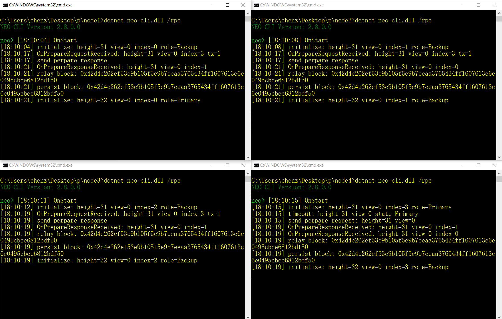

# NEO-Private-Net
[中文说明](#zh)

## Description

The files in the project are configured private net that can be run directly after download. 

The project contains a private net of Neo 2.x and Neo 3.0 preview.

NEO and GAS have been claimed in the wallet `a.json`, with a password of `1` and block count is about 40.

Version description:

Neo 2.10.3

​	-- Neo CLI v2.10.3

​	-- Neo GUI v2.10.3

Neo 3.0.0 Preview1

​	-- Neo CLI v3.0.0 Preview1

## Environment

Windows10

Running neo-cli doesn't require additional environments

Running neo-gui required to install [.NetFramework 4.7.2](https://www.microsoft.com/net/download/dotnet-framework-runtime)

## Run

Go to the neo-cli directory, double-click `neo-cli.exe`

As shown in the figure:

## Stop

Just close the NEO-CLI window directly.

## 说明
项目中的文件为已配置好的私有链，下载后可以直接运行。

项目中包含 Neo 2.x 版本和 Neo 3.0 预览版的私有链。

已提取 NEO 和 GAS，提到到钱包 `a.json` 中，密码为 `1`，区块高度为 40 左右。

版本说明：

Neo 2.10.3

​	-- Neo CLI v2.10.3

​	-- Neo GUI v2.10.3

Neo 3.0.0 Preview1

​	-- Neo CLI v3.0.0 Preview1

## 运行环境

Windows10

运行 neo-cli 不需要安装额外环境

运行 neo-gui 需要安装 [.NetFramework 4.7.2](https://www.microsoft.com/net/download/dotnet-framework-runtime)

## 启动私有链

进入 neo-cli 目录，双击 `neo-cli.exe`

如图所示：

## 停止私有链

直接关闭 NEO-CLI 的窗口即可。