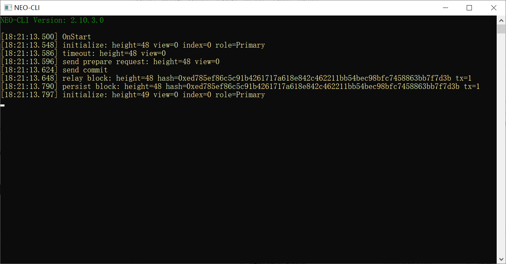

# NEO-Private-Net
NEO Private Net

## 说明
项目中的文件为已配置好的私有链，下载后可以直接运行。
共识节点版本为 neo-cli 2.8.0，已提取 NEO 和 GAS，提到到钱包 1.json 中，密码为 11111111，区块高度为 30 左右。

## 运行环境

Windows10

运行 neo-cli 需要安装 [.NET Core 2.1](https://www.microsoft.com/net/download/thank-you/dotnet-runtime-2.1.3-windows-hosting-bundle-installer)

运行 neo-gui 需要安装 [.NetFramework 4.7.1](https://www.microsoft.com/net/download/dotnet-framework-runtime) 以及 [VC++ 2010 Redist x64](https://www.microsoft.com/en-us/download/details.aspx?id=14632) / [x86](https://www.microsoft.com/en-us/download/details.aspx?id=5555)

## 启动私有链

进入 node1 目录，双击 `1Run.cmd`

进入 node2 目录，双击 `1Run.cmd`

进入 node3 目录，双击 `1Run.cmd`

进入 node4 目录，双击 `1Run.cmd`

如图所示：

## 停止私有链

在任务栏中右击 `命令提示符`，点击 `关闭所有窗口`。